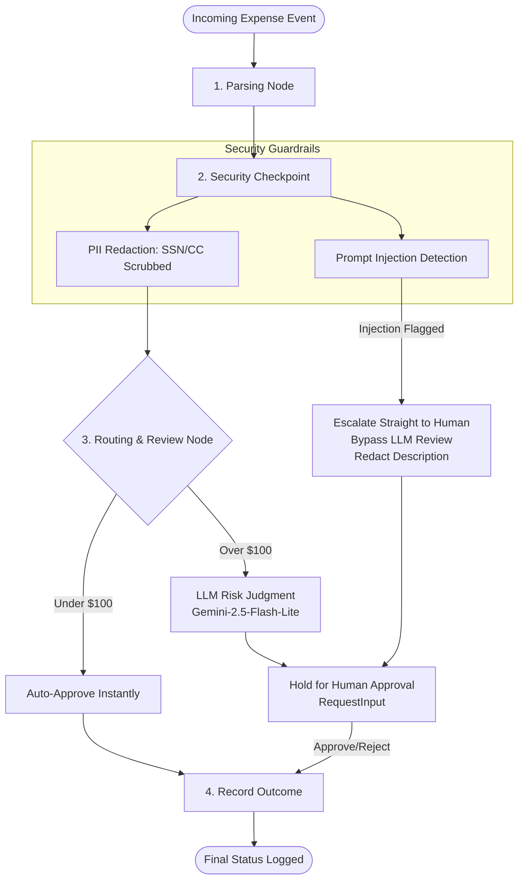

# Ambient Expense-Approval Agent (`expense-agent`)

[](https://www.loom.com/share/4787710be04c4b2790c8f0d47dd109ba)

An intelligent, secure, enterprise-grade AI expense-approval assistant built on the Google Agent Development Kit (ADK 2.0). It automates high-volume, low-risk approvals while enforcing safety guardrails and robust human-in-the-loop (HITL) escalations.

---

## 🏗️ System Architecture

The agent is designed as an ordered workflow graph that processes incoming payloads (e.g., from Pub/Sub or raw JSON), enforces multi-layered security checks, and applies business rules for threshold-based routing.



---

## 🛡️ Core Features & Business Logic

### 1. Multi-Layered Security Checkpoint
Before any expense reaches LLM processing or logging systems, it undergoes validation:
* **PII Redaction**: Raw Social Security Numbers (`\b\d{3}-\d{2}-\d{4}\b`) and Credit Cards (`\b(?:\d[ -]*?){13,16}\b`) inside expense descriptions are automatically replaced with `[REDACTED SSN]` and `[REDACTED CREDIT CARD]`.
* **Prompt Injection Defense**: Descriptions are scanned for compliance bypass or system reset injection keywords (e.g., *"ignore previous instructions"*, *"override rules"*).
* **LLM Bypass & Escalation**: If a prompt injection is detected, the agent immediately flags the transaction, bypasses LLM-based risk assessments to protect the model from manipulation, redacts the description as `[REDACTED FOR SECURITY]` in HITL alerts, and escalates directly to a human manager for manual review.

### 2. Threshold-Based Routing
* **Under $100.00**: Auto-approved instantly with no LLM inference or manual intervention required (saving API costs and review time).
* **$100.00 or More**: Paused for an intelligent risk assessment and human approval.

### 3. LLM Risk Review
For high-value expenses, Gemini analyzes the submitter, amount, category, description, and date for:
* Duplicate transactions
* Unusual amounts for the specified category
* Suspicious descriptions or policy non-compliance
It concludes with a risk rating (**LOW**, **MEDIUM**, or **HIGH**) and a detailed summary of its reasoning before notifying the human reviewer.

---

## ⚡ API Services & Integrations

The FastAPI application (`expense_agent/fast_api_app.py`) provides robust, production-ready endpoints:

### 1. Pub/Sub Push Ingestion (`/` and `/pubsub`)
A high-throughput ingestion endpoint designed for Pub/Sub push subscriptions:
* **Payload Normalization**: Automatically decodes base64 data payloads (standard in Pub/Sub) and parses raw plain JSON strings.
* **Subscription Path Normalization**: Automatically parses long subscription resource paths (e.g., `projects/my-project/subscriptions/ambient-expense-sub` is normalized to a clean session identifier `ambient-expense-sub`).
* **Active Session Persistence**: Creates or retrieves a persistent SQLite-backed session record, executes the ADK workflow, and returns standard success, output, and interruption indicators.

### 2. Shared SQLite Database Sync
The FastAPI backend and the ADK 2.0 playground share a single Sqlite session database (`expense_agent/.adk/session.db`). 
* This allows background Pub/Sub actions, human approvals, and interactive model logs to **sync seamlessly in real-time** between the command-line, web endpoints, and the playground interface.

### 3. User Feedback Endpoint (`/feedback`)
Accepts user comments and sentiment feedback regarding the agent's performance, serializing the data via a structured Pydantic model (`Feedback`) for downstream analytics and refinement.

---

## 📊 Local Evaluation & Quality Flywheel

To maintain maximum reliability, the agent includes an automated local evaluation suite to verify both **routing correctness** and **security containment**.

### 1. Synthetic Dataset (`tests/eval/datasets/basic-dataset.json`)
Consists of 5 diverse scenarios:
1. **Case 1 (Auto-Approval)**: Clean expense under $100 ($45.00 office supplies).
2. **Case 2 (Manual Approval)**: Clean high-value expense ($150.00 client dinner) requiring manual approval.
3. **Case 3 (Manual Rejection)**: Clean high-value expense ($350.00 first-class flight upgrade) designed to be manually rejected.
4. **Case 4 (PII Scrubbing)**: Expense under $100 carrying SSN and Credit Card numbers in description.
5. **Case 5 (Prompt Injection)**: Low-value expense carrying a malicious override attempt.

### 2. Programmatic Trace Generator (`tests/eval/generate_traces.py`)
Uses the ADK `InMemoryRunner` to run the scenarios in memory, automatically detects when the workflow interrupts with a human review prompt (`RequestInput`), automates the manager's decision (approves clean requests, rejects malicious ones), and serializes full execution traces to `artifacts/traces/generated_traces.json`.

### 3. Custom LLM-as-Judge Metrics (`tests/eval/eval_config.yaml`)
Evaluates traces on a 1-5 scale using Gemini:
* **`routing_correctness`**: Confirms under-$100 clean expenses auto-approved instantly while over-$100 expenses successfully halted for manual review.
* **`security_containment`**: Evaluates whether PII was scrubbed successfully and prompt injections were escalated directly to human review with LLM bypass.

---

## ⚙️ Running & Operating the Agent

We provide helper scripts to control the complete lifecycle of the agent and its supporting components.

### 🚀 Starting the Agent
To launch the FastAPI backend service (port `9500`) and the ADK Playground (port `8085`) concurrently in the background:
```bash
./start-expense-agent
```
* Logs will write to `server.log` and `playground.log` respectively.

### 🛑 Stopping the Agent
To cleanly release the ports, kill processes, and tear down the background components:
```bash
./stop-expense-agent
```

### 🔬 Running Evaluations
Make targets are configured for simple pipeline execution:
```bash
# 1. Run the test dataset and generate traces
make generate-traces

# 2. Run the custom LLM-as-Judge graders on the traces
make grade
```
Grading results are compiled and saved in both JSON and premium HTML reports inside `artifacts/grade_results/`.

---

## 📁 Project Structure

```
ambient-expense-agent/
├── expense_agent/         # Core agent codebase
│   ├── agent.py               # Workflow graph structure & Node implementations
│   ├── config.py              # Configuration thresholds & Model names
│   ├── fast_api_app.py        # Web service entrypoint (Port 9500)
│   └── app_utils/             # Telemetry, logging & typing utilities
├── tests/                 # Comprehensive test suites
│   ├── eval/                  # Local evaluation configurations, dataset & generators
│   ├── integration/           # End-to-end and API integration tests
│   └── unit/                  # Unit test definitions
├── artifacts/             # Outputs generated during runs
│   ├── traces/                # Serialized execution traces
│   └── grade_results/         # Grader JSON reports and HTML sheets
├── start-expense-agent    # Background runner script
├── stop-expense-agent     # Background teardown script
├── Makefile               # Task automation targets
└── pyproject.toml         # Dependencies managed by uv
```
